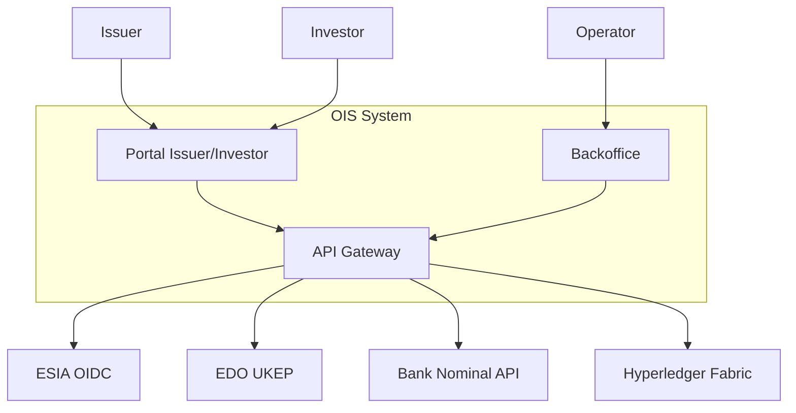
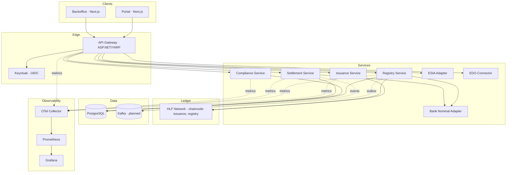
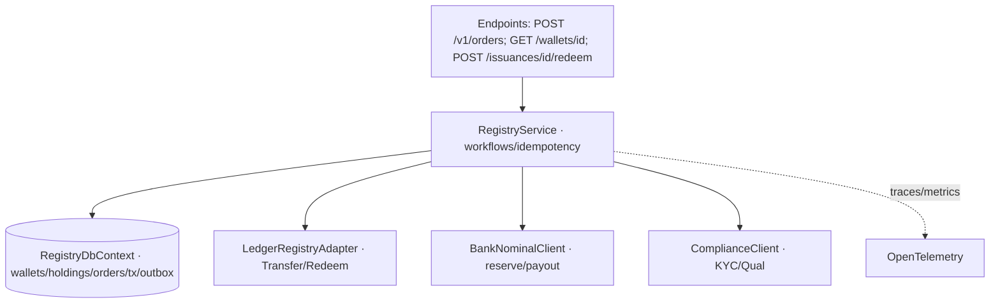
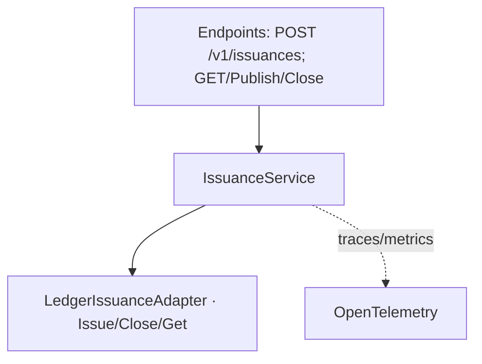
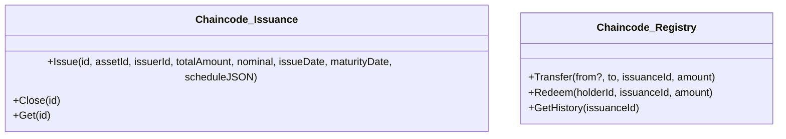

# OIS-CFA · C4 Diagrams (Mermaid)

## C1 — Context


## C2 — Containers


## C3 — Registry Service (components)


## C3 — Issuance Service (components)


## C4 — Code (chaincode high-level)



**TL;DR**

* Сформировал `ois-cfa.shtgn.reposcan.json` по Shotgun‑Pro шаблону (contexts/containers/components/schema/APIs/topology/sources). [Скачать](sandbox:/mnt/data/ois-cfa.shtgn.reposcan.json). Основано на contracts, .NET сервисах, HLF/Helm/infra.
* Добавил полный набор C4 (Mermaid): C1/C2 + C3 (Registry/Issuance) + C4 (chaincode). Ниже код и отдельный файл. [Скачать .md](sandbox:/mnt/data/ois-cfa-c4-mermaid.md).
* Ключевые факты: ESIA/Bank/EDO OpenAPI; Gateway→clusters; Prometheus/OTel/Grafana; HLF chaincode (issuance/registry); Postgres схемы (wallets/holdings/orders/tx/outbox, investors_compliance, reconciliation_log).

---

## Steps

1. **Ингест/нормализация**
   Взял Shotgun‑Pro `01-reposcan.shtgn.template.json` и правила (roles, anchors, C4-infer) → собрал единый JSON.

2. **Контейнеры/интеграции**
   Сопоставил Gateway→clusters (identity/issuance/registry/settlement/compliance) и IDP Keycloak; external: ESIA, Bank Nominal, EDO; Ledger: Hyperledger Fabric (issuance/registry chaincode).

3. **API**
   Свёл endpoints из contracts (issuance/registry/settlement/compliance + ESIA/Bank/EDO). Добавил idempotency для orders/settlement.

4. **Data schema**
   Извлёк сущности EF/Migrations: `wallets`, `holdings`, `orders`, `tx`, `outbox_messages`; из compliance — `investors_compliance`; из settlement — `reconciliation_log`. Числовые поля — `numeric(20,8)`.

5. **Обсервабилити**
   OTEL collector + Prometheus scrape + Grafana dashboards (HTTP metrics / P95 / errors). 

---

## Table (scope snapshot)

| Layer    | Что есть                                                        | Техстек                   | Ключ. связи                                 |
| -------- | --------------------------------------------------------------- | ------------------------- | ------------------------------------------- |
| C1       | ОИС + внеш. (ESIA/Bank/EDO/HLF)                                 | Web/IDP/HLF               | Порталы→Gateway→сервисы→HLF/Bank/EDO/ESIA   |
| C2       | Gateway, Issuance, Registry, Settlement, Compliance             | .NET 9, Next.js, Keycloak | Clusters/YARP, Postgres, OTEL/Prom/Grafana  |
| C3 (Reg) | Core, LedgerAdapter, Bank/Compliance clients, DbContext, Outbox | C#/EF                     | Кошельки/ордера/транзакции/idempotency      |
| C3 (Iss) | LedgerIssuance Adapter + API                                    | C#                        | Issue/Close/Get, mock/real HLF              |
| C4       | Chaincode issuance/registry                                     | Go (HLF)                  | инстал/approve/commit via Helm/jobs/scripts |

---

## Next actions

* ✅ Проверь JSON разделы vs. ожидания Shotgun‑Pro (при необходимости — разбить по секциям). 
* ✅ Уточнить **реальный** Fabric endpoint и включить non‑mock режим в Ledger‑адаптерах (сейчас mock по умолчанию).
* ✅ Доформализовать AsyncAPI (Kafka) и wiring из `outbox_messages`. 
* ✅ Зафиксировать Keycloak realm/clients/roles (env of backoffice). 
* ✅ ERD/queries: добавить индексы по `orders.status`, `tx.status`, check‑констрейнты по суммам (если нужно).

---

## Artifacts

* **Reposcan JSON:** [Download `ois-cfa.shtgn.reposcan.json`](sandbox:/mnt/data/ois-cfa.shtgn.reposcan.json)
* **C4 Mermaid (MD):** [Download `ois-cfa-c4-mermaid.md`](sandbox:/mnt/data/ois-cfa-c4-mermaid.md)

### C1 — Context (Mermaid)


### C2 — Containers


### C3 — Registry Service (components)

```mermaid
flowchart TB
  api[Endpoints: POST /v1/orders; GET /wallets/{id}; POST /issuances/{id}/redeem]
  core[RegistryService · workflows/idempotency]
  db[(RegistryDbContext · wallets/holdings/orders/tx/outbox)]
  ledger[LedgerRegistryAdapter · Transfer/Redeem]
  bank[BankNominalClient · reserve/payout]
  compliance[ComplianceClient · KYC/Qual]
  otel[OpenTelemetry]

  api --> core
  core --> db
  core --> ledger
  core --> bank
  core --> compliance
  core -. traces/metrics .-> otel
```

### C3 — Issuance Service (components)


### C4 — Code (chaincode high-level)


---

### Примечания (validation & provenance)

* Gateway→clusters (YARP) и маршруты сервисов подтверждены в конфиге. 
* ESIA/Bank/EDO OpenAPI → использованы для API перечня.
* Registry endpoints и DTO подтверждены кодом и контрактами.
* Issuance/Settlement/Compliance — по контрактам (в т.ч. idempotency/отчётность).
* Postgres схемы и миграции — EF + migrations; settlement reconciliation log.
* HLF/Helm/скрипты approve/commit — включены в topology и sources.
* Observability: OTEL collector, Prometheus scrape, Grafana dashboard. 

Если нужно — могу разнести JSON по файлам (`contexts.json`, `schema.json`, …) или сгенерировать PNG/SVG диаграммы из Mermaid.
