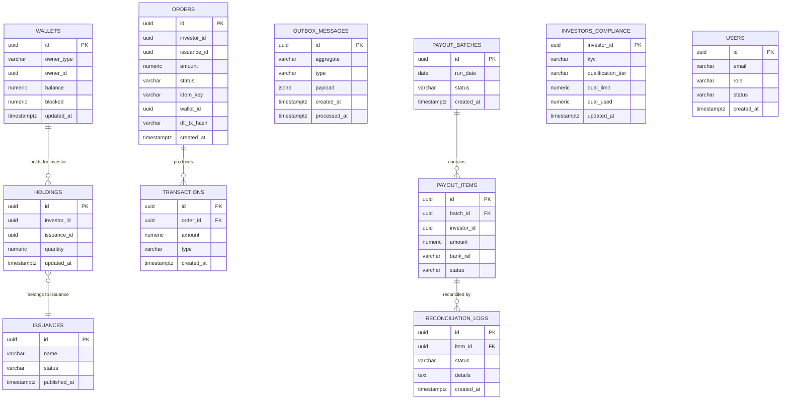

# OIS-CFA · ER Model (Mermaid)

The ER diagram reflects key tables used by core services. Actual schemas may evolve; consult DbContext files for source of truth.

```mermaid
erDiagram
  WALLETS {
    uuid id PK
    varchar owner_type
    uuid owner_id
    numeric balance
    numeric blocked
    timestamptz updated_at
  }

  HOLDINGS {
    uuid id PK
    uuid investor_id
    uuid issuance_id
    numeric quantity
    timestamptz updated_at
  }

  ORDERS {
    uuid id PK
    uuid investor_id
    uuid issuance_id
    numeric amount
    varchar status
    varchar idem_key
    uuid wallet_id
    varchar dlt_tx_hash
    timestamptz created_at
  }

  TRANSACTIONS {
    uuid id PK
    uuid order_id FK
    numeric amount
    varchar type
    timestamptz created_at
  }

  OUTBOX_MESSAGES {
    uuid id PK
    varchar aggregate
    varchar type
    jsonb payload
    timestamptz created_at
    timestamptz processed_at
  }

  ISSUANCES {
    uuid id PK
    varchar name
    varchar status
    timestamptz published_at
  }

  PAYOUT_BATCHES {
    uuid id PK
    date run_date
    varchar status
    timestamptz created_at
  }

  PAYOUT_ITEMS {
    uuid id PK
    uuid batch_id FK
    uuid investor_id
    numeric amount
    varchar bank_ref
    varchar status
  }

  RECONCILIATION_LOGS {
    uuid id PK
    uuid item_id FK
    varchar status
    text details
    timestamptz created_at
  }

  INVESTORS_COMPLIANCE {
    uuid investor_id PK
    varchar kyc
    varchar qualification_tier
    numeric qual_limit
    numeric qual_used
    timestamptz updated_at
  }

  USERS {
    uuid id PK
    varchar email
    varchar role
    varchar status
    timestamptz created_at
  }

  WALLETS ||--o{ HOLDINGS : "holds for investor"
  HOLDINGS }o--|| ISSUANCES : "belongs to issuance"
  ORDERS ||--o{ TRANSACTIONS : "produces"
  PAYOUT_BATCHES ||--o{ PAYOUT_ITEMS : "contains"
  PAYOUT_ITEMS ||--o{ RECONCILIATION_LOGS : "reconciled by"
```
