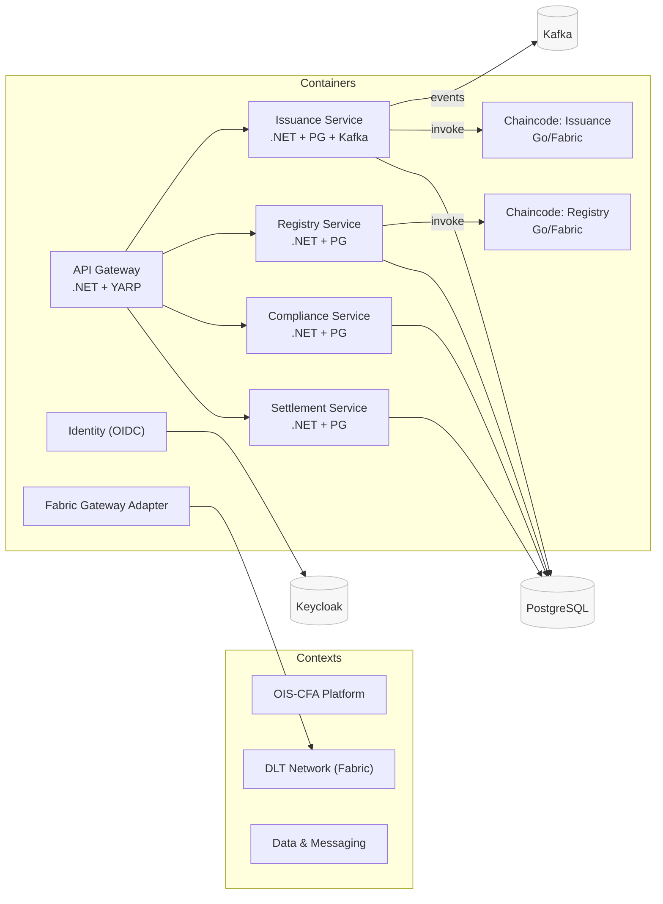

# OIS‑CFA · C4 Container View (Mermaid)

```mermaid
flowchart LR
  subgraph Contexts
    OIS["OIS‑CFA Platform"]
    DLT["DLT Network (Fabric)"]
    Data["Data & Messaging"]
  end

  subgraph Containers
    GW["API Gateway\n.NET + YARP"]
    ISS["Issuance Service\n.NET + PG + Kafka"]
    REG["Registry Service\n.NET + PG"]
    CMP["Compliance Service\n.NET + PG"]
    SETT["Settlement Service\n.NET + PG"]
    IDP["Identity (OIDC)"]
    FGW["Fabric Gateway Adapter"]
    CCISS["Chaincode: Issuance\nGo/Fabric"]
    CCREG["Chaincode: Registry\nGo/Fabric"]
  end

  GW --> ISS
  GW --> REG
  GW --> CMP
  GW --> SETT

  ISS -->|events| KAFKA[(Kafka)]
  ISS -->|invoke| CCISS
  REG -->|invoke| CCREG
  FGW --> DLT

  REG --> PG[(PostgreSQL)]
  CMP --> PG
  ISS --> PG
  SETT --> PG

  IDP --> KEYC[(Keycloak)]

  classDef ext fill:#f7f7f7,stroke:#bbb,stroke-width:1px
  class KAFKA,PG,KEYC ext
```
