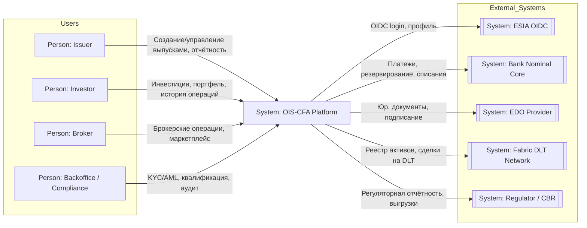
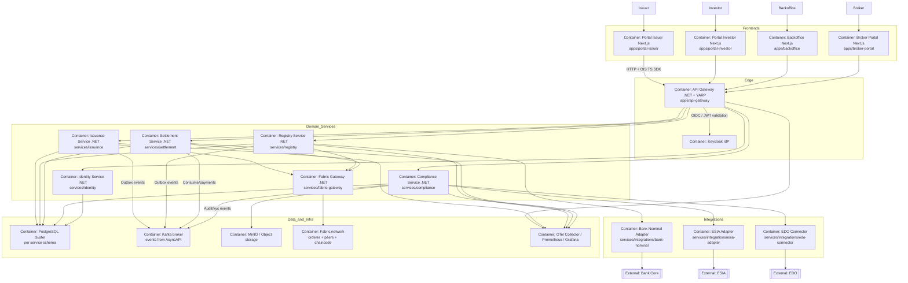
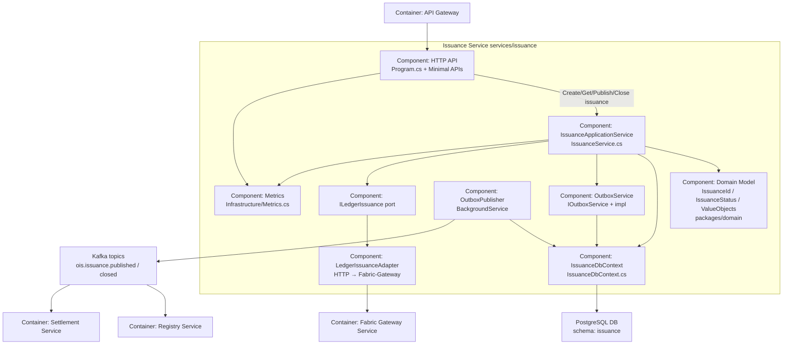
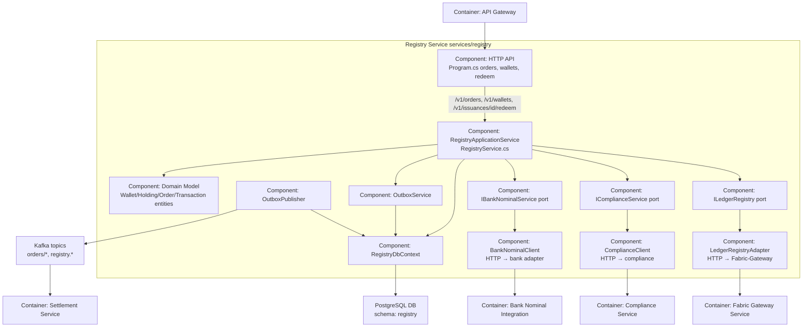
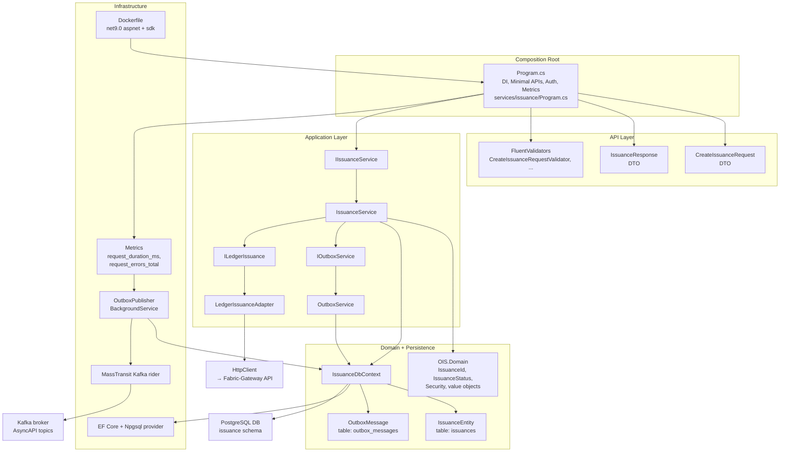

# Project map

## 1. C1–C4 диаграммы Mermaid

### 1.1 C1 — System Context OIS‑CFA и внешние акторы

Основано на PROJECT-CONTEXT, архитектурных openapi‑/asyncapi‑доках и описании интеграций с ESIA, банком, EDO и Fabric.

---

### 1.2 C2 — Containers фронты, gateway, сервисы, инфраструктура

Контейнеры взяты из дерева `apps/*`, `services/*`, `ops/infra/*`, `packages/contracts/*` и API/Event‑матрицы в PROJECT-CONTEXT.

---

### 1.3 C3 — Components: Issuance & Registry NX‑03 / NX‑04

Эти C3-диаграммы фокусируются на доменах, важнейших для NX‑03 issuance endpoints + tests и NX‑04 registry order flow.

#### 1.3.1 C3 — Issuance Service `services/issuance`

Основные соответствия C3↔NX:

* NX‑03 использует `is_api`, `is_app`, `is_dbctx`, `is_outbox_*`, `is_ledger_*` + их тесты `services/issuance/issuance.Tests`.

---

#### 1.3.2 C3 — Registry Service `services/registry`

Соответствие C3↔NX:

* NX‑04 работает ровно по этому разрезу: `reg_api` маршруты /orders, /redeem, `reg_app` стейт‑машина заказа create→reserve→paid, зависимости на банк/комплаенс/Fabric и события в Kafka.

---

### 1.4 C4 — Code/Modules: `services/issuance`

Этот C4‑уровень деталирует `services/issuance` на классы/модули и показывает, как они реализуют компоненты C3. Основано на `IssuanceDbContext`, DTO‑ах, Metrics, Dockerfile и тестах.

Связь C3→C4:

* C3‑компонент **HTTP API** = `Program.cs` + DTO/validators.
* **IssuanceApplicationService** = `IssuanceService` + интерфейс `IIssuanceService`.
* **Persistence** = `IssuanceDbContext` + `IssuanceEntity`/`OutboxMessage` + EF Core.
* **Ledger adapter** = `ILedgerIssuance` + `LedgerIssuanceAdapter` + HttpClient.
* **Outbox** = `IOutboxService` + `OutboxService` + `OutboxPublisher` + MassTransit/Kafka.
