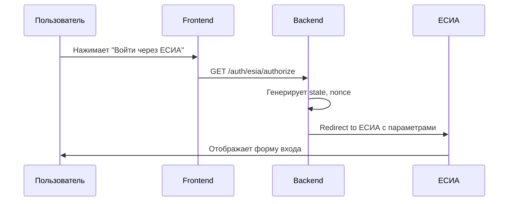
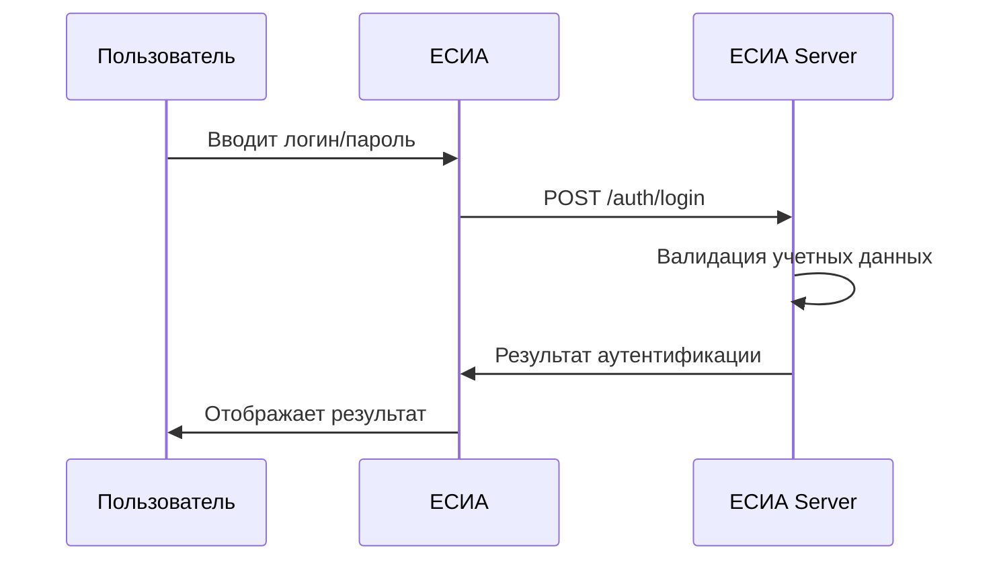
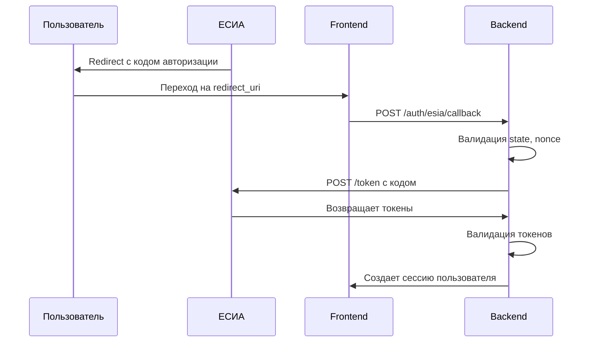
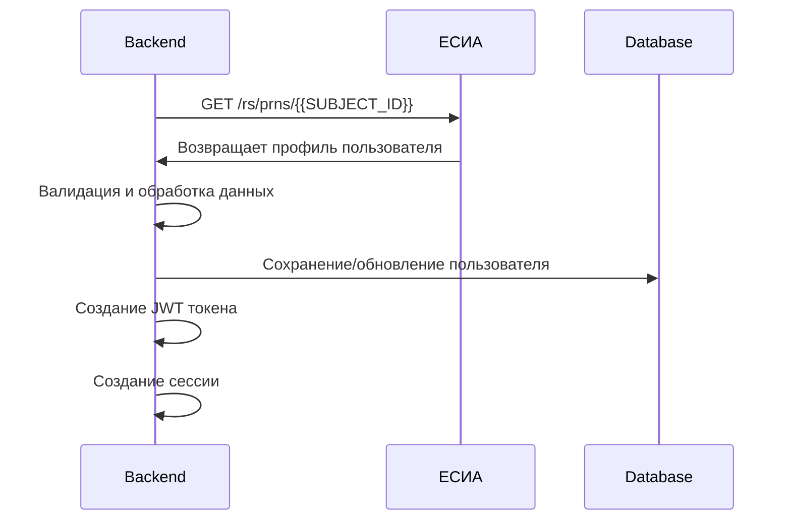

# ПОСЛЕДОВАТЕЛЬНОСТЬ ИНТЕГРАЦИИ С ЕСИА
## OIDC/OAuth2 Flow для ОИС ЦФА

**Версия:** {{VERSION}}  
**Дата:** {{DATE}}  
**Оператор:** {{COMPANY_NAME}}

---

## 1. ОБЗОР ИНТЕГРАЦИИ

### 1.1. Цель интеграции

**Основные задачи:**
- Идентификация пользователей через ЕСИА
- Получение персональных данных
- Верификация документов
- Создание учетных записей

**Преимущества:**
- Единая точка входа
- Снижение рисков
- Соответствие требованиям
- Удобство пользователей

### 1.2. Технологии

**OIDC (OpenID Connect):**
- Стандарт аутентификации
- Основан на OAuth2
- Поддержка JWT токенов
- Расширяемость

**OAuth2:**
- Авторизация
- Токены доступа
- Области доступа
- Безопасность

**JWT (JSON Web Token):**
- Структурированные токены
- Цифровая подпись
- Валидация
- Трассировка

---

## 2. АРХИТЕКТУРА ИНТЕГРАЦИИ

### 2.1. Компоненты системы

```
┌─────────────────┐    ┌─────────────────┐    ┌─────────────────┐
│   Пользователь   │    │   ОИС ЦФА      │    │     ЕСИА        │
│                 │    │                 │    │                 │
│  - Браузер      │    │  - Frontend     │    │  - OIDC Provider│
│  - Мобильное    │    │  - Backend      │    │  - User Store   │
│    приложение   │    │  - Identity     │    │  - Auth Server  │
└─────────────────┘    └─────────────────┘    └─────────────────┘
```

### 2.2. Поток данных

**1. Инициация аутентификации:**
- Пользователь → ОИС
- ОИС → ЕСИА
- ЕСИА → Пользователь

**2. Аутентификация:**
- Пользователь → ЕСИА
- ЕСИА → Валидация
- ЕСИА → Токены

**3. Получение данных:**
- ОИС → ЕСИА
- ЕСИА → Пользователь
- ОИС → Создание сессии

---

## 3. ПОСЛЕДОВАТЕЛЬНОСТЬ ОПЕРАЦИЙ

### 3.1. Инициация аутентификации

**Шаг 1: Пользователь нажимает "Войти через ЕСИА"**



**Параметры запроса:**
```http
GET https://esia.gosuslugi.ru/aas/oauth2/ac?response_type=code&client_id={{CLIENT_ID}}&redirect_uri={{REDIRECT_URI}}&scope=openid+profile+email+address&state={{STATE}}&nonce={{NONCE}}
```

**Параметры:**
- `response_type=code` - код авторизации
- `client_id` - идентификатор клиента
- `redirect_uri` - URL возврата
- `scope` - области доступа
- `state` - защита от CSRF
- `nonce` - защита от replay атак

### 3.2. Аутентификация в ЕСИА

**Шаг 2: Пользователь вводит данные в ЕСИА**



**Процесс аутентификации:**
1. Валидация учетных данных
2. Проверка статуса аккаунта
3. Генерация токенов
4. Создание сессии

### 3.3. Получение кода авторизации

**Шаг 3: ЕСИА возвращает код авторизации**



**Параметры callback:**
```http
GET {{REDIRECT_URI}}?code={{AUTHORIZATION_CODE}}&state={{STATE}}
```

**Обмен кода на токены:**
```http
POST https://esia.gosuslugi.ru/aas/oauth2/token
Content-Type: application/x-www-form-urlencoded

grant_type=authorization_code&client_id={{CLIENT_ID}}&client_secret={{CLIENT_SECRET}}&code={{AUTHORIZATION_CODE}}&redirect_uri={{REDIRECT_URI}}
```

### 3.4. Получение данных пользователя

**Шаг 4: Получение профиля пользователя**



**Запрос профиля:**
```http
GET https://esia.gosuslugi.ru/rs/prns/{{SUBJECT_ID}}
Authorization: Bearer {{ACCESS_TOKEN}}
```

**Структура профиля:**
```json
{
  "sub": "{{SUBJECT_ID}}",
  "given_name": "Иван",
  "family_name": "Иванов",
  "middle_name": "Иванович",
  "birthdate": "1990-01-01",
  "gender": "male",
  "email": "ivan@example.com",
  "phone_number": "+7(999)123-45-67",
  "address": {
    "street_address": "ул. Примерная, д. 1",
    "locality": "Москва",
    "postal_code": "123456",
    "country": "RU"
  },
  "document": {
    "type": "passport",
    "series": "1234",
    "number": "567890",
    "issued_by": "ОУФМС России",
    "issued_date": "2010-01-01"
  }
}
```

---

## 4. ОБРАБОТКА ДАННЫХ

### 4.1. Валидация токенов

**JWT токен структура:**
```json
{
  "header": {
    "alg": "RS256",
    "typ": "JWT",
    "kid": "{{KEY_ID}}"
  },
  "payload": {
    "iss": "https://esia.gosuslugi.ru",
    "sub": "{{SUBJECT_ID}}",
    "aud": "{{CLIENT_ID}}",
    "exp": 1640995200,
    "iat": 1640908800,
    "nonce": "{{NONCE}}",
    "scope": "openid profile email address"
  },
  "signature": "{{SIGNATURE}}"
}
```

**Валидация:**
1. Проверка подписи
2. Проверка времени жизни
3. Проверка аудитории
4. Проверка nonce

### 4.2. Создание пользователя

**Логика создания:**
```csharp
public async Task<User> CreateUserFromEsiaProfile(EsiaProfile profile)
{
    var user = new User
    {
        EsiaSubjectId = profile.SubjectId,
        FirstName = profile.GivenName,
        LastName = profile.FamilyName,
        MiddleName = profile.MiddleName,
        BirthDate = profile.BirthDate,
        Gender = profile.Gender,
        Email = profile.Email,
        Phone = profile.PhoneNumber,
        Address = profile.Address,
        Document = profile.Document,
        Status = UserStatus.Verified,
        CreatedAt = DateTime.UtcNow,
        UpdatedAt = DateTime.UtcNow
    };

    await _userRepository.CreateAsync(user);
    return user;
}
```

### 4.3. Управление сессией

**Создание сессии:**
```csharp
public async Task<Session> CreateSession(User user)
{
    var session = new Session
    {
        UserId = user.Id,
        SessionId = Guid.NewGuid().ToString(),
        CreatedAt = DateTime.UtcNow,
        ExpiresAt = DateTime.UtcNow.AddHours(8),
        IsActive = true
    };

    await _sessionRepository.CreateAsync(session);
    return session;
}
```

---

## 5. БЕЗОПАСНОСТЬ

### 5.1. Защита от атак

**CSRF защита:**
- State параметр
- Валидация origin
- SameSite cookies
- CSRF токены

**Replay атаки:**
- Nonce параметр
- Временные окна
- Одноразовые токены
- Валидация времени

**Man-in-the-middle:**
- HTTPS только
- Certificate pinning
- HSTS заголовки
- Валидация сертификатов

### 5.2. Валидация данных

**Входные данные:**
- Санитизация
- Валидация типов
- Проверка длины
- Экранирование

**Токены:**
- Проверка подписи
- Валидация времени
- Проверка аудитории
- Валидация nonce

**Персональные данные:**
- Шифрование
- Маскирование
- Аудит доступа
- Контроль целостности

---

## 6. ОБРАБОТКА ОШИБОК

### 6.1. Типы ошибок

**Ошибки аутентификации:**
- Неверные учетные данные
- Заблокированный аккаунт
- Истекший токен
- Недостаточные права

**Ошибки сети:**
- Таймауты
- Недоступность сервиса
- Ошибки DNS
- Проблемы с сертификатами

**Ошибки валидации:**
- Неверный формат
- Отсутствующие поля
- Некорректные данные
- Нарушение политик

### 6.2. Обработка исключений

**Стратегия обработки:**
```csharp
public async Task<AuthResult> HandleEsiaAuth(string code, string state)
{
    try
    {
        // Валидация параметров
        if (!ValidateAuthParameters(code, state))
        {
            return AuthResult.InvalidParameters();
        }

        // Обмен кода на токены
        var tokens = await ExchangeCodeForTokens(code);
        
        // Валидация токенов
        if (!ValidateTokens(tokens))
        {
            return AuthResult.InvalidTokens();
        }

        // Получение профиля
        var profile = await GetUserProfile(tokens.AccessToken);
        
        // Создание пользователя
        var user = await CreateOrUpdateUser(profile);
        
        // Создание сессии
        var session = await CreateSession(user);
        
        return AuthResult.Success(session);
    }
    catch (EsiaException ex)
    {
        _logger.LogError(ex, "Ошибка интеграции с ЕСИА");
        return AuthResult.EsiaError(ex.Message);
    }
    catch (ValidationException ex)
    {
        _logger.LogWarning(ex, "Ошибка валидации данных");
        return AuthResult.ValidationError(ex.Message);
    }
    catch (Exception ex)
    {
        _logger.LogError(ex, "Неожиданная ошибка аутентификации");
        return AuthResult.SystemError();
    }
}
```

---

## 7. МОНИТОРИНГ И ЛОГИРОВАНИЕ

### 7.1. Метрики

**Бизнес-метрики:**
- Количество попыток входа
- Успешные аутентификации
- Ошибки аутентификации
- Время отклика

**Технические метрики:**
- Время обмена токенов
- Время получения профиля
- Ошибки валидации
- Таймауты

### 7.2. Логирование

**Структурированные логи:**
```json
{
  "timestamp": "2024-01-01T12:00:00Z",
  "level": "INFO",
  "service": "identity",
  "operation": "esia_auth",
  "user_id": "{{USER_ID}}",
  "session_id": "{{SESSION_ID}}",
  "duration_ms": 1500,
  "status": "success",
  "details": {
    "esia_subject_id": "{{SUBJECT_ID}}",
    "scope": "openid profile email",
    "token_type": "Bearer"
  }
}
```

**Аудит безопасности:**
- Попытки входа
- Неудачные аутентификации
- Подозрительная активность
- Изменения профиля

---

## 8. ТЕСТИРОВАНИЕ

### 8.1. Unit тесты

**Тестирование валидации:**
```csharp
[Test]
public async Task ValidateEsiaToken_ValidToken_ReturnsTrue()
{
    // Arrange
    var token = CreateValidToken();
    var validator = new EsiaTokenValidator();

    // Act
    var result = await validator.ValidateAsync(token);

    // Assert
    Assert.IsTrue(result.IsValid);
    Assert.IsNull(result.Error);
}
```

### 8.2. Integration тесты

**Тестирование потока:**
```csharp
[Test]
public async Task EsiaAuthFlow_ValidCredentials_CreatesUser()
{
    // Arrange
    var client = new TestClient();
    var mockEsia = new MockEsiaProvider();

    // Act
    var response = await client.PostAsync("/auth/esia/callback", new
    {
        code = "valid_code",
        state = "valid_state"
    });

    // Assert
    Assert.AreEqual(200, response.StatusCode);
    var user = await GetUserFromDatabase();
    Assert.IsNotNull(user);
    Assert.AreEqual("Иван", user.FirstName);
}
```

### 8.3. E2E тесты

**Полный поток:**
```csharp
[Test]
public async Task CompleteEsiaAuthFlow_EndToEnd()
{
    // Arrange
    var browser = new Browser();
    var esiaMock = new EsiaMockServer();

    // Act
    await browser.NavigateTo("/login");
    await browser.Click("Войти через ЕСИА");
    await browser.FillEsiaForm("test@example.com", "password");
    await browser.Submit();

    // Assert
    Assert.IsTrue(await browser.IsLoggedIn());
    var user = await GetCurrentUser();
    Assert.AreEqual("test@example.com", user.Email);
}
```

---

## 9. РАЗВЕРТЫВАНИЕ

### 9.1. Конфигурация

**Переменные окружения:**
```bash
ESIA_CLIENT_ID=your_client_id
ESIA_CLIENT_SECRET=your_client_secret
ESIA_REDIRECT_URI=https://your-domain.com/auth/esia/callback
ESIA_SCOPE=openid profile email address
ESIA_AUTHORIZATION_URL=https://esia.gosuslugi.ru/aas/oauth2/ac
ESIA_TOKEN_URL=https://esia.gosuslugi.ru/aas/oauth2/token
ESIA_USERINFO_URL=https://esia.gosuslugi.ru/rs/prns
```

**Конфигурация в коде:**
```csharp
public class EsiaOptions
{
    public string ClientId { get; set; }
    public string ClientSecret { get; set; }
    public string RedirectUri { get; set; }
    public string Scope { get; set; }
    public string AuthorizationUrl { get; set; }
    public string TokenUrl { get; set; }
    public string UserInfoUrl { get; set; }
    public TimeSpan Timeout { get; set; } = TimeSpan.FromSeconds(30);
}
```

### 9.2. Мониторинг

**Health checks:**
```csharp
public class EsiaHealthCheck : IHealthCheck
{
    public async Task<HealthCheckResult> CheckHealthAsync(HealthCheckContext context, CancellationToken cancellationToken = default)
    {
        try
        {
            var client = new HttpClient();
            var response = await client.GetAsync("https://esia.gosuslugi.ru/health", cancellationToken);
            
            if (response.IsSuccessStatusCode)
            {
                return HealthCheckResult.Healthy("ЕСИА доступен");
            }
            
            return HealthCheckResult.Unhealthy("ЕСИА недоступен");
        }
        catch (Exception ex)
        {
            return HealthCheckResult.Unhealthy("Ошибка проверки ЕСИА", ex);
        }
    }
}
```

---

## 10. ОБСЛУЖИВАНИЕ

### 10.1. Мониторинг производительности

**Ключевые метрики:**
- Время аутентификации
- Успешность операций
- Ошибки интеграции
- Использование ресурсов

**Алерты:**
- Высокое время отклика
- Много ошибок
- Недоступность ЕСИА
- Аномальная активность

### 10.2. Обновления и патчи

**Планирование:**
- Регулярные обновления
- Тестирование изменений
- Откат при проблемах
- Документирование

**Процедуры:**
- Backup перед обновлением
- Поэтапное развертывание
- Мониторинг после обновления
- Откат при необходимости

---

**Дата создания:** {{DATE}}  
**Автор:** {{AUTHOR}}  
**Статус:** Утверждено  
**Версия:** {{VERSION}}
