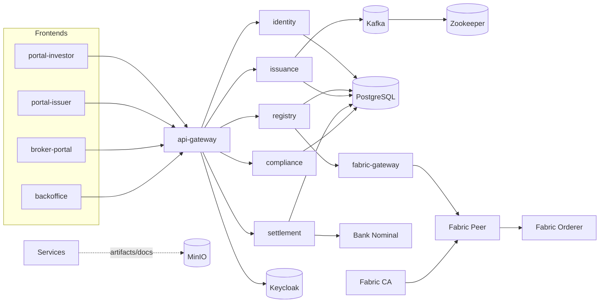

# OIS-CFA · Service Dependency Map (Mermaid)

```mermaid
flowchart LR
  subgraph Frontends
    INV[portal‑investor]
    IP[portal‑issuer]
    BP[broker‑portal]
    BO[backoffice]
  end

  API[api‑gateway]
  IDP[identity]
  REG[registry]
  ISS[issuance]
  SETT[settlement]
  COMP[compliance]
  FABGW[fabric‑gateway]

  PG[(PostgreSQL)]
  KAFKA[(Kafka)]
  ZK[(Zookeeper)]
  MINIO[(MinIO)]
  KEYCLOAK[(Keycloak)]
  BANK[Bank Nominal]
  PEER[Fabric Peer]
  ORDERER[Fabric Orderer]
  CA[Fabric CA]

  INV --> API
  IP  --> API
  BP  --> API
  BO  --> API

  API --> IDP & REG & ISS & SETT & COMP
  IDP --> PG
  REG --> PG
  ISS --> PG
  SETT --> PG
  COMP --> PG

  ISS --> KAFKA
  KAFKA --> ZK
  API --> KEYCLOAK
  Services -.artifacts/docs.-> MINIO

  REG --> FABGW --> PEER --> ORDERER
  CA --> PEER
  SETT --> BANK
```
