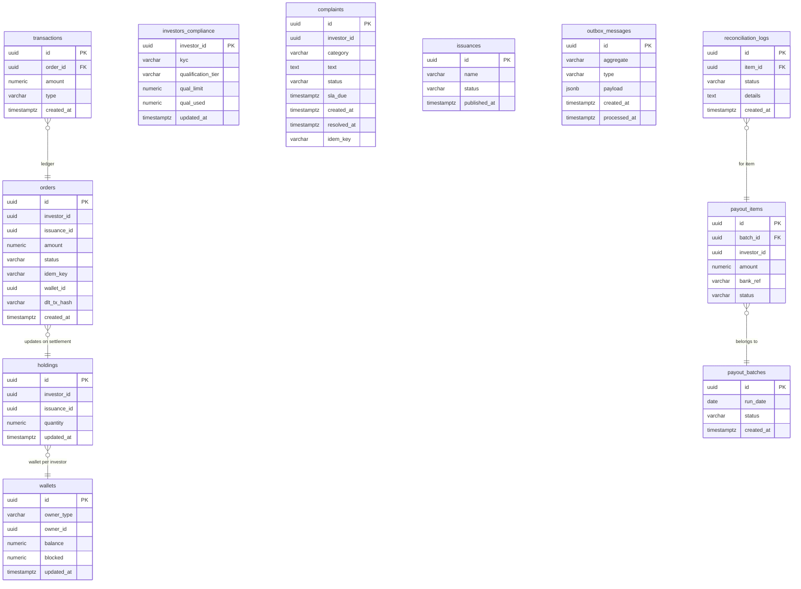

# OIS‑CFA · ER Diagram (Mermaid)

```mermaid
erDiagram
  wallets {
    uuid id PK
    varchar owner_type
    uuid owner_id
    numeric balance
    numeric blocked
    timestamptz updated_at
  }
  holdings {
    uuid id PK
    uuid investor_id
    uuid issuance_id
    numeric quantity
    timestamptz updated_at
  }
  orders {
    uuid id PK
    uuid investor_id
    uuid issuance_id
    numeric amount
    varchar status
    varchar idem_key
    uuid wallet_id
    varchar dlt_tx_hash
    timestamptz created_at
  }
  transactions {
    uuid id PK
    uuid order_id FK
    numeric amount
    varchar type
    timestamptz created_at
  }
  investors_compliance {
    uuid investor_id PK
    varchar kyc
    varchar qualification_tier
    numeric qual_limit
    numeric qual_used
    timestamptz updated_at
  }
  complaints {
    uuid id PK
    uuid investor_id
    varchar category
    text text
    varchar status
    timestamptz sla_due
    timestamptz created_at
    timestamptz resolved_at
    varchar idem_key
  }
  issuances {
    uuid id PK
    varchar name
    varchar status
    timestamptz published_at
  }
  outbox_messages {
    uuid id PK
    varchar aggregate
    varchar type
    jsonb payload
    timestamptz created_at
    timestamptz processed_at
  }
  payout_batches {
    uuid id PK
    date run_date
    varchar status
    timestamptz created_at
  }
  payout_items {
    uuid id PK
    uuid batch_id FK
    uuid investor_id
    numeric amount
    varchar bank_ref
    varchar status
  }
  reconciliation_logs {
    uuid id PK
    uuid item_id FK
    varchar status
    text details
    timestamptz created_at
  }

  holdings }o--|| wallets : "wallet per investor"
  orders }o--|| holdings : "updates on settlement"
  transactions }o--|| orders : "ledger"
  payout_items }o--|| payout_batches : "belongs to"
  reconciliation_logs }o--|| payout_items : "for item"
```
